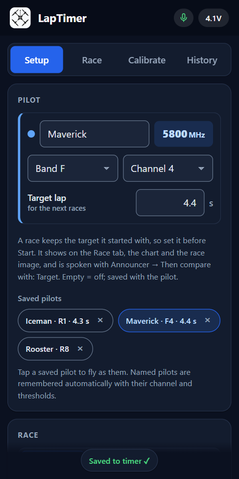
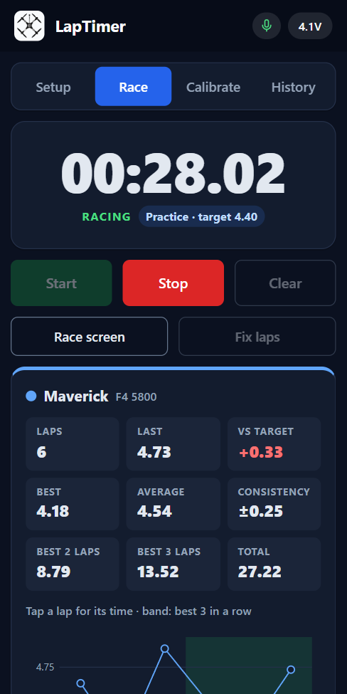
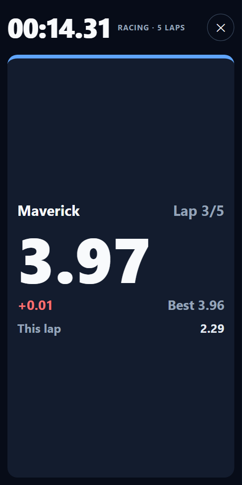
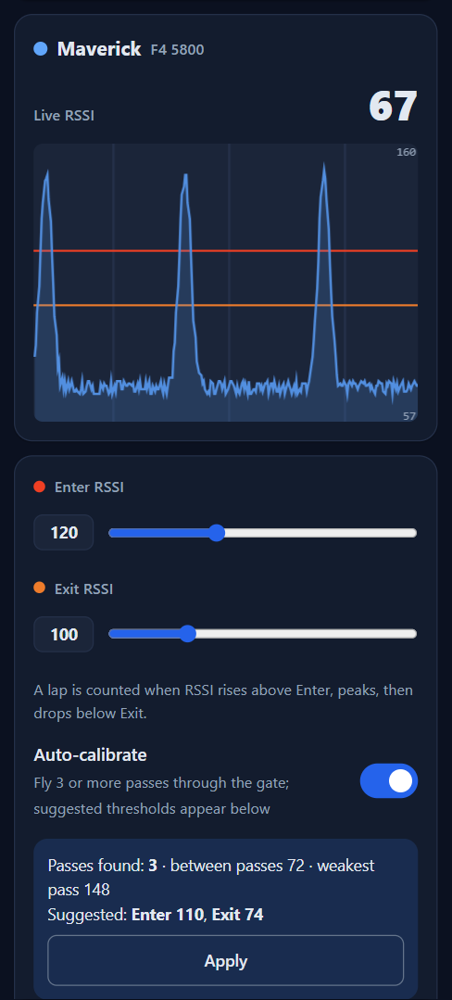
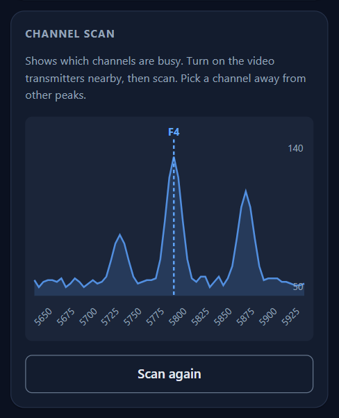
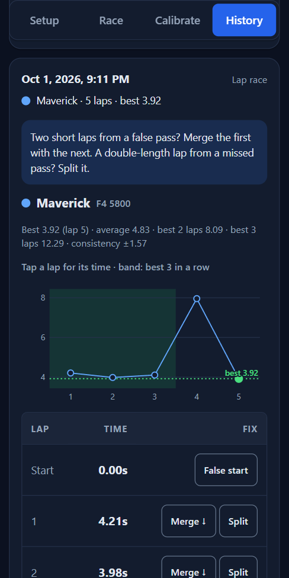
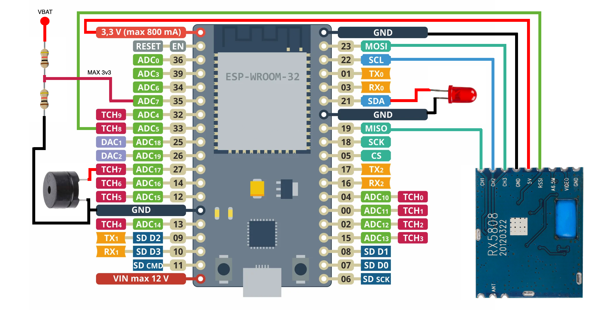
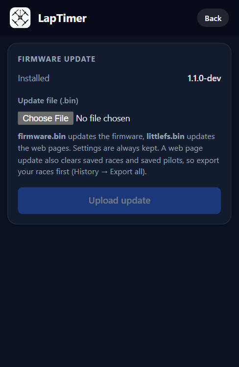

# LapTimer

A standalone FPV drone lap timer: an ESP32 and one RX5808 5.8 GHz receiver at the gate,
and a phone as the display. Voice announcements, race modes, race history, saved pilots
and a race screen, all from a web page the timer serves itself. No app, no internet.

Based on [PhobosLT](https://github.com/phobos-/PhobosLT) and
[PhobosLT_pooling](https://github.com/nikbg3/PhobosLT_pooling).

<p align="center">
  
  
  
</p>

## Features

**Racing**
- One pilot per timer, sampled continuously for full precision (see [timing precision](#timing-precision)).
- Race modes: **practice** (unlimited), **timed** (finish on the first pass after the time is
  up) and **lap race** (finish after N laps).
- **Countdown start** (3-2-1-go beeps) or the race starts on the first gate pass.
- Last lap, delta to best, best, average, best 3 consecutive and consistency.
- **Race screen**: big numbers for a phone or tablet at the field, with a live current-lap timer.

**Voice and sound**
- The phone announces lap times in English, with deltas, best laps and the finish.
- Voice commands: "start", "stop", "best time", "clear time".
- Buzzer and LED on the timer for laps, countdown, time up, race finished and low battery.

**Setup and calibration**
- **Saved pilots**: every named pilot is remembered with their channel and thresholds;
  one tap switches who is flying.
- Band and channel picker.
- **Calibration graph** with 25 ms resolution, and **auto-calibration**: fly 3+ passes and it
  suggests Enter/Exit from the real passes (found by the minimum lap time) and the signal
  level between them, or says what to change when the passes don't stand out.
- **Channel scan** to see which channels are busy before choosing.

**After the race**
- Every race is saved on the timer (last 30) with **CSV export**.
- **Fix laps**: merge two laps split by a false pass, or split a lap where a pass was missed.

**Connection**
- Own hotspot, or up to 5 saved **home WiFi** networks (the strongest in range is used).
- `http://laptimer.local` on your WiFi; firmware updates over WiFi from the page.
- Settings save automatically and stay consistent across several open phones.

<p align="center">
  
  
  
</p>

## Hardware

- ESP32 dev board (classic ESP32; ESP32-C3 and ESP32-S3 targets are also in `targets/`)
- RX5808 5.8 GHz receiver module (SPI-modded)
- Optional: buzzer, LED, 1S LiPo with a 1:2 voltage divider for the battery reading

| ESP32 | Connects to |
|---|---|
| 33 | RX5808 RSSI |
| 19 | RX5808 CH1 (data) |
| 22 | RX5808 CH2 (select) |
| 23 | RX5808 CH3 (clock) |
| 3V3 / GND | RX5808 power |
| 21 | LED (+ resistor) to GND |
| 27 | Buzzer to GND |
| 35 | Battery voltage through a 1:2 divider |



A 3D-printable case for the LilyGO T-Energy board is in [`stl/`](stl/).

## Install

1. Install [PlatformIO](https://platformio.org/) (VS Code extension or CLI).
2. Build and flash the firmware and the web pages:
   ```
   pio run -e PhobosLT -t upload
   pio run -e PhobosLT -t uploadfs
   ```
   If the board doesn't enter flash mode, hold **BOOT**, tap **EN**, then release BOOT.

Later updates can go over WiFi: open **Setup → Timer → Firmware update**, or run
`python tools/ota_upload.py <timer-ip> fw fs`.

<p align="center">
  
</p>

## Connect

**Timer hotspot** (default)
- WiFi network `LapTimer_xxxx 192.168.4.1`, password `laptimer`. The address is in the name.
- Open `http://192.168.4.1`. If the phone says the WiFi has no internet, stay connected;
  if the page doesn't load, turn off mobile data.

**Your WiFi**
1. **Setup → WiFi networks**: add your network (Scan helps), then **Restart timer**.
2. Open `http://laptimer.local`, or the timer's IP from your router.
3. At power-up it joins the strongest saved network in range (60 s to connect). If none is
   seen, it tries the newest one for 20 s (a hidden network, or a phone hotspot still starting),
   then starts its own hotspot. **Forget all** returns to hotspot mode.

## Use

1. **Setup**: enter the pilot's name and channel, or tap a saved pilot. Settings save automatically.
2. **Calibrate** at the gate: switch on **Auto-calibrate** and fly 3+ passes, then **Apply**.
   By hand: **Enter** below the peaks of your passes, **Exit** just above the level while the
   drone is away (a pass ends when the signal drops below Exit). Run a **channel scan** first
   if others are flying.
3. **Race**: press **Start** (or say "start"). Open the **Race screen** for big numbers.
4. **History**: every race is saved. Open one to see all laps, **Fix laps**, or export CSV.

Voice needs a normal browser tab (Chrome, Brave, Safari). Tap **Test voice** once after
opening the page; phones only allow speech after a tap.

## Timing precision

The receiver stays on the pilot's channel and reads the signal thousands of times per second.
A pass is timed at the middle of the signal peak, so the timer itself adds about a
millisecond. What remains is how sharp the peak is: put the timer right at the gate, keep
the drone far away for the rest of the lap, and calibrate Enter/Exit from real passes.

Why one pilot: after every channel change the RX5808 needs 36-45 ms to lock (measured), so a
receiver shared between pilots reads each of them only every 100-200 ms, and a fast whoop
pass falls between the readings. Racing several pilots needs a receiver per pilot, as in
RotorHazard.

## Development

See [CLAUDE.md](CLAUDE.md) for how the project is built, tested and released, and
[`tools/`](tools/) for the simulated timer, WiFi upload, device test, RSSI/pass logger and boot
log scripts.

## License

MIT, see [LICENSE](LICENSE). Based on PhobosLT by phobos- and PhobosLT_pooling by nikbg3.
